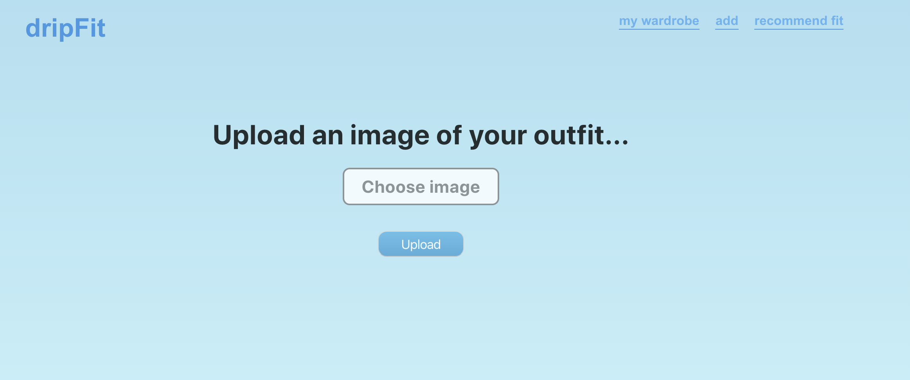
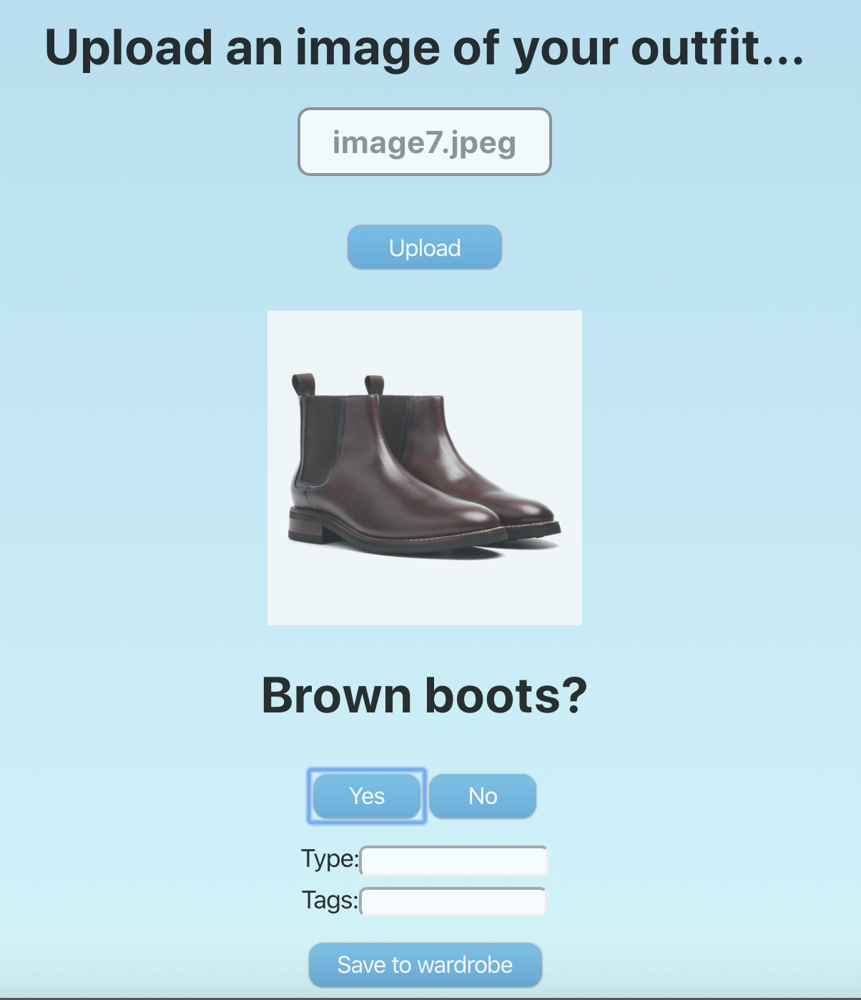
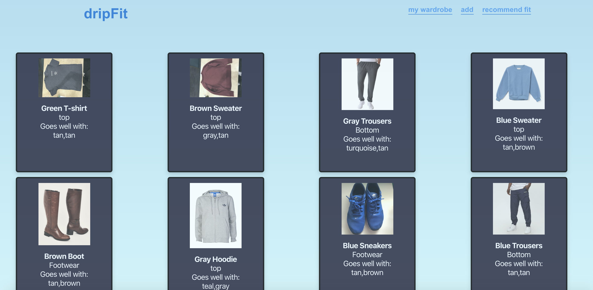
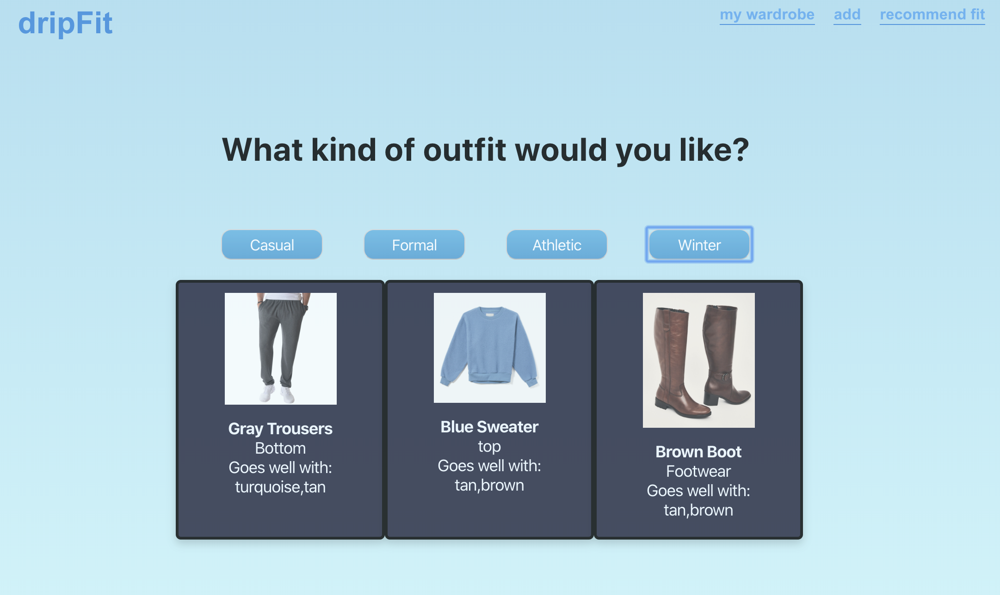

# TO TEST, run the following commands in their corresponding directories:

npm start in ./web/my-app/

npm start in ./web/my-app/server

node index.js in ./server_db (need to enter either a local or cloud mongo key in properties)

then head to http://localhost:3000/

## Inspiration

The biggest inspiration for us when we decided to make dripFit is we realized that it is not easy to match clothes, especially if you are not the biggest fashion fan. We set out to make this easier for as many people as possible, making it extremely easy for the user to find out which clothes they own pair well with other articles of clothing in their wardrobe.

## What it does

When a user opens dripFit, all they have to do is add pictures of their clothes to their digital wardrobe, and then it will generate recommended outfits for the user based off of a smart color Machine Learning algorithm that matches colors and articles of clothing.

## How we built it

We built it with React, Express, MongoDB, ColorTag API, and Google Cloud Vision API.

## Machine Learning and Artificial Intelligence

One of the biggest parts of this project was definitely implementing the ML models and APIs. Since these were the core elements of our project, we had to make sure they were working properly. In the end, the app matches clothes based on fashion data from things like movies, tv shows, art, and many more.

## Challenges we ran into

The Google Cloud Vision API was very hard to deal with because it was not easy to authenticate the API key so that API calls could be made. Additionally, connecting the front-end to the back-end proved to be a challenge because there were data errors, complications with sending information between files, and storing images in the Database.

## Accomplishments that we're proud of

We were able to build a fully functioning web app with a front-end, back-end, database, and state management in under 36 hours. Additionally, we came up with the idea about 12 hours into the hackathon, so we were proud of landing on our feet.

## What we learned

We learned how Google Computer Vision works and understands how to connect all the different stages in a web app. Additionally, we harnessed the power of AI and used that to help the user make better matching decisions.

## What's next for dripFit

We want to continue developing dripFit by making a mobile app, potentially with React Native.

